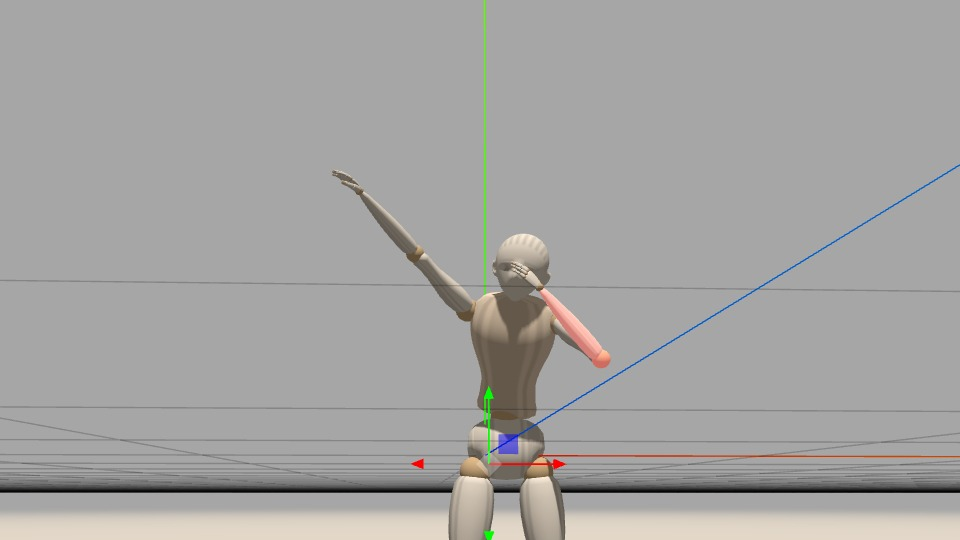
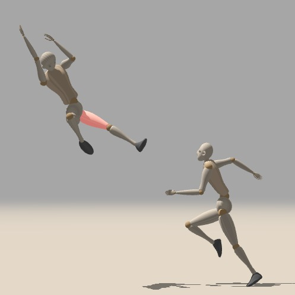

# pose-toolkit

pose-toolkit is a local-first browser app for posing 3D mannequins, importing models, and exporting reference images.

This app uses mannequin-js as its articulated human figure foundation: https://github.com/boytchev/mannequin.js/

## Requirements

- Node.js 18+
- npm
- A modern browser

## Quick Start

### Windows

```powershell
cd pose-toolkit
start.bat
```

### macOS / Linux

```bash
cd pose-toolkit
chmod +x start.sh
./start.sh
```

Both scripts:

- install dependencies
- build the app
- start the Vite dev server
- open the browser at `http://localhost:5173`

## Manual Local Run

### Windows PowerShell

```powershell
cd pose-toolkit
npm install
npm run build
npm run dev
```

### macOS / Linux

```bash
cd pose-toolkit
npm install
npm run build
npm run dev
```

Then open:

```text
http://localhost:5173
```

## Local Deployment Build

Create a production build:

```bash
npm run build
```

Preview the production build locally:

```bash
npm run preview -- --host
```

## How To Use

- Click **Add Mannequin** to add a default mannequin or load one from a JSON file
- Select a mannequin to move or rotate it with the gizmo
- Use the right panel to pose joints, enable IK, and switch camera angles
- Use **Import GLB** to bring in external 3D assets
- Use **Save** and **Load** for local project JSON files
- Use **Export** to capture the framed render

## GenAI Examples

These examples show how a pose exported from pose-toolkit can be used as a reference image for image-to-image generation.

### Example 1

| pose-toolkit reference | generated image |
| --- | --- |
|  |  |

### Example 2

| pose-toolkit reference | generated image |
| --- | --- |
|  |  |

## OS Notes

- **Windows:** use `start.bat` for one-click local startup
- **macOS:** use `chmod +x start.sh` once, then run `./start.sh`
- **Linux:** use `chmod +x start.sh` once, then run `./start.sh`

## Output

- Development server: `http://localhost:5173`
- Production files: `dist/`
